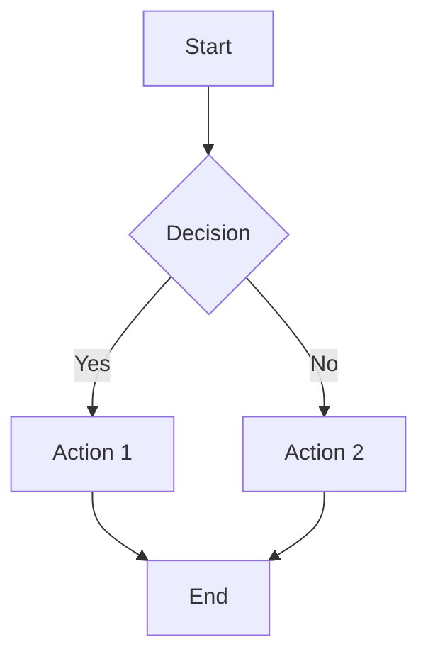

# Mermaid Diagram Generator

A user-friendly GUI application for converting Mermaid diagram code into high-quality images. This Python application provides an intuitive interface for creating diagrams with various output formats, themes, and customization options.

## Features

- **Interactive GUI**: Clean, modern interface built with tkinter
- **Multiple Output Formats**: Generate PNG, SVG, or PDF files
- **Theme Support**: Choose from Default, Dark, or Forest themes
- **Resolution Control**: Scale PNG outputs from 1x to 4x resolution
- **Transparency Options**: Support for transparent backgrounds
- **File Operations**: Load existing Mermaid files or start from scratch
- **Sample Code**: Includes a pre-loaded energy flow diagram example
- **Real-time Status**: Visual feedback during diagram generation

## Prerequisites

### Required Software

1. **Python 3.6+** with tkinter support
2. **Node.js and npm** (for Mermaid CLI installation)
3. **Mermaid CLI**: Install globally using npm

```bash
npm install -g @mermaid-js/mermaid-cli
```

### Python Dependencies

The script uses only Python standard library modules:
- `tkinter` (GUI framework)
- `subprocess` (CLI execution)
- `tempfile` (temporary file handling)
- `pathlib` (path operations)
- `json` (configuration handling)

## Installation

1. **Clone or download** this repository
2. **Install Mermaid CLI**:
   ```bash
   npm install -g @mermaid-js/mermaid-cli
   ```
3. **Verify installation**:
   ```bash
   mmdc --version
   ```

## Usage

### Running the Application

```bash
python "mermaid code to image.py"
```

### Using the Interface

1. **Enter Mermaid Code**: Type or paste your Mermaid diagram code in the text area
2. **Choose Output Format**: Select PNG, SVG, or PDF
3. **Set Resolution**: For PNG files, choose scaling from 1x to 4x
4. **Select Theme**: Pick Default, Dark, or Forest theme
5. **Configure Background**: Optionally enable transparent background
6. **Generate**: Click "Generate & Save Image" and choose save location

### Loading Files

- Click **"Load File"** to import existing Mermaid files (`.mmd`, `.txt`)
- Supported file encodings: UTF-8

### Sample Diagram

The application includes a pre-loaded energy flow diagram showing:
- Solar PV output and distribution
- Battery storage and losses
- Inverter efficiency
- Load consumption patterns

## Supported Mermaid Diagram Types

- **Flowcharts** (`graph`, `flowchart`)
- **Sequence Diagrams** (`sequenceDiagram`)
- **Class Diagrams** (`classDiagram`)
- **State Diagrams** (`stateDiagram`)
- **Entity Relationship Diagrams** (`erDiagram`)
- **User Journey** (`journey`)
- **Gantt Charts** (`gantt`)
- **Pie Charts** (`pie`)
- **Git Graphs** (`gitgraph`)

## Output Options

### Formats
- **PNG**: Raster images with scalable resolution
- **SVG**: Vector graphics for web and print
- **PDF**: Document-ready format

### Themes
- **Default**: Standard Mermaid styling
- **Dark**: Dark background with light text/lines
- **Forest**: Green-themed color scheme

### Resolution (PNG only)
- **1x**: Standard resolution
- **2x**: High-DPI displays
- **3x**: Extra high resolution
- **4x**: Maximum quality

## Configuration

The application automatically detects the Mermaid CLI installation. The default path is configured for Windows npm global installations:
```
C:\Users\[Username]\AppData\Roaming\npm\mmdc.cmd
```

For different operating systems or custom installations, you may need to modify line 220 in the script.

## Troubleshooting

### Common Issues

**"Mermaid CLI not found"**
- Ensure Node.js and npm are installed
- Install Mermaid CLI: `npm install -g @mermaid-js/mermaid-cli`
- Verify installation: `mmdc --version`

**"Generation timed out"**
- Complex diagrams may take longer to render
- Try simplifying the diagram or increasing timeout in the code

**"Failed to load file"**
- Check file encoding (should be UTF-8)
- Ensure file contains valid Mermaid syntax

### Platform-Specific Notes

**Windows**: Uses `.cmd` extension for CLI commands
**macOS/Linux**: May need to adjust CLI path to use `mmdc` directly

## Example Mermaid Code



## File Structure

```
mermaid/
├── mermaid code to image.py    # Main application
└── README.md                   # This documentation
```

## Contributing

Feel free to submit issues, feature requests, or pull requests to improve this tool.

## License

This project is open source. Please check the repository for specific license terms.

## Version History

- **Current**: Full-featured GUI with multiple output formats and themes
- Includes sample energy flow diagram
- Support for transparent backgrounds
- Enhanced error handling and user feedback

---

**Note**: This application requires an active internet connection for the first run of Mermaid CLI to download necessary dependencies.
